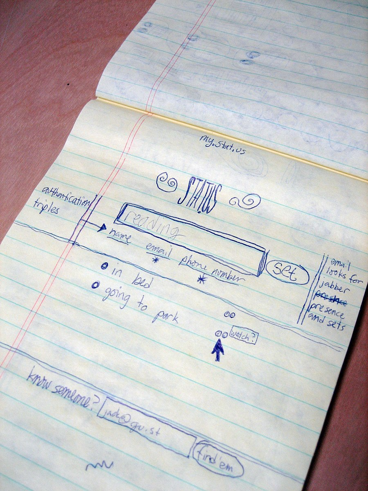
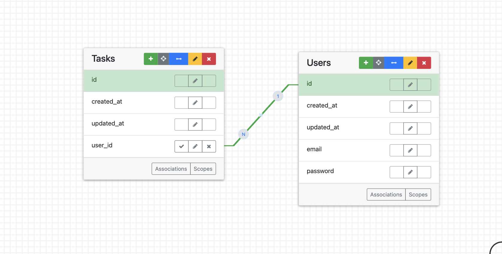

# Writing Functional Requirements and Specifications

## Introduction

In this lesson, we will cover the process of writing functional requirements and specifications for a software project. Functional requirements focus on what the system should do from the user's perspective. Specifications, on the other hand, detail how those functions will be implemented, outlining the design and structure of the solution.

We will walk through user stories, sketching ideas, creating domain models, and finally assembling functional requirements and specifications. Each step will help you organize your ideas and communicate them clearly to developers, designers, and stakeholders.

## Learning Objectives

By the end of this lesson, you should be able to:

- Understand the role of functional requirements and specifications in software development.
- Write clear and concise user stories.
- Create basic wireframes and sketches of application flows.
- Design domain models and entity relationship diagrams (ERDs).
- Compile a functional specification that guides the development process.

## 1. Sketch Ideas

Before diving into requirements, it's often helpful to sketch out the basic idea of the application. This will help you visualize the user flow and identify key screens.

### Speedy Eights Technique

Use the [Speedy Eights](https://thoughtbot.com/product-design-sprint/guide/diverge/speedy-eights) method to generate ideas quickly and get some thoughts on paper.
1. Divide a sheet of paper into 8 panels.
2. For the first round, sketch the flow of your app through these panels. 
3. In another round, sketch 8 variations of the most important screen in your app.

Remember, you are only supposed to spend around 40 seconds per panel. Set a timer and stick to it. Try using a [sharpie rather than a pen](https://signalvnoise.com/posts/1788-oldie-but-goodie-sketching-with-a-sharpie) to prevent yourself from getting into too much detail in this phase.

### Wireframe

Then, select one flow you like, and draw out each screen in a bit more detail. Pen and paper is totally fine.

Here is an early sketch of X (formerly Twitter) (formerly Twttr) circa 2006 for inspiration.



## 2. Write User Stories

A good way to define functional requirements is through [user stories](https://www.romanpichler.com/blog/10-tips-writing-good-user-stories/). A user story is a simple description of a feature from the perspective of the user.

The basic format for a user story is:
> **As a** [role], **I want to** [capability], **so that** [benefit].

This format ensures that you stay focused on the user's needs and goals rather than on technical details.

### Steps to Write User Stories:

1. Brainstorm all possible features as user stories.
2. Re-order these stories by priority.
3. Identify the **minimum viable product (MVP)** by eliminating non-essential stories. Be ruthless in eliminating all non-essential user stories for this 1st draft.
4. Move only the essential stories to a new list: this will be your proof-of-concept feature-set.

These proof-of-concept features are what you should try to design a domain model for. Don't plan ahead for anything else — you'll just create extra work for yourself, for likely no return. Remember that we will most likely throw away our first proof of concept and re-write it with our learnings.

## 3. Domain Modeling

Before implementing your user stories, you need to design a **domain model**. This is a conceptual model that describes the data entities, their relationships, and the rules governing them.

### What to Include in Your Domain Model:

- **Tables**: List all the tables you need.
- **Columns**: Specify the columns for each table, their data types, and any validation rules.
- **Associations**: Identify any one-to-many or many-to-many relationships between entities, including foreign keys and join tables.

Creating a domain model helps ensure that your database structure supports all the user stories and features you plan to implement. I recommend building out an entity relationship diagram with [ideas.firstdraft.com](https://ideas.firstdraft.com). Use a spreadsheet to draw out all the tables/columns and try entering in rows to make sure we can record everything necessary for all screens and possible user actions in the mockup. You may even want to write some pseudocode model classes. ([example](https://gist.github.com/heratyian/7ad30b31ce2818c4fcaf39fabf7ca154))



```ruby
# - id
# - created_at
# - updated_at
# - email
# - password

class User
  has_many :tasks
end

# - id
# - created_at
# - updated_at
# - content
# - user_id
class Task
  belongs_to :user
end
```

## 4. Writing Functional Specifications

A **functional specification** is a detailed document that describes the functions a system must perform to satisfy the user's needs. This is your **"north star"** throughout the development process, helping you and your team stay aligned on the project goals. A well-written functional specification should enable anyone, such as a quality assurance tester, to verify that the system performs as expected.

### Elements of a Functional Specification:
1. **Project Name** and **1-liner**: A clear and concise summary of the project.
2. **Pain Point**: What problem are you solving?
3. **Target User Persona**: Who is the primary user of this application?
4. **Hypothesis**: What is the core value you are testing?
5. **User Stories**: Include the prioritized user stories.
6. **Domain Model**: Include your domain model ERD, a link to a spreadsheet with sample data, and perhaps some pseudocode models.
7. **Sketches**: Include the sketches of your app’s flow and key screens.

### Examples
- [Pensieve](https://gist.github.com/thierrychau/0d558373c7605ed4459f21a80ea86112)
- [Clip Cloud](https://gist.github.com/salcasta/186adcf445a19a4c3ba40fb4503c44e2)
- [3E: Efficiently Effortless Exercise](https://gist.github.com/jpfababaer/9a61220d9e05c20e04e22160662aebc5)
- [One Slot](https://gist.github.com/ahuynh3a/acdbc91bfa58467beee70b0156d3cef8)
- [Vitals](https://gist.github.com/amandaag39/72ec6eea2c66c4f24a0d114827a1b47d)
- [The Efficient Birder](https://gist.github.com/WCW789/759992593c6405bc384546fd8f5c55cd)
- [Gymbuds](https://gist.github.com/joannarodriguez134/68aab785ee490f0bc4a786b66ecbbdf7)
- [Readit](https://gist.github.com/heratyian/7ad30b31ce2818c4fcaf39fabf7ca154)

### Assignment

Please write a functional specification for your project using a [GitHub Gist](https://gist.github.com/) and share your url.

- Enter your functional specification gist URL:
- https://gist.github.com/username/id
  - Great job!
- any
  - Not quite. Make sure the URL looks like: `https://gist.github.com/username/id`
{: .free_text #functional_spec_gist_url title="Submit Functional Specification" points="1" answer="1" }

<div class="alert alert-danger mt-2">

After you submit the URL here, return to Canvas and submit the URL again in the assignment "
Submit Functional Specification".


An instructor will provide additional feedback on your submission there.

</div>


---

- Approximately how long (in minutes) did this lesson take you to complete?
{: .free_text_number #time_taken title="Time taken" points="1" answer="any" }
